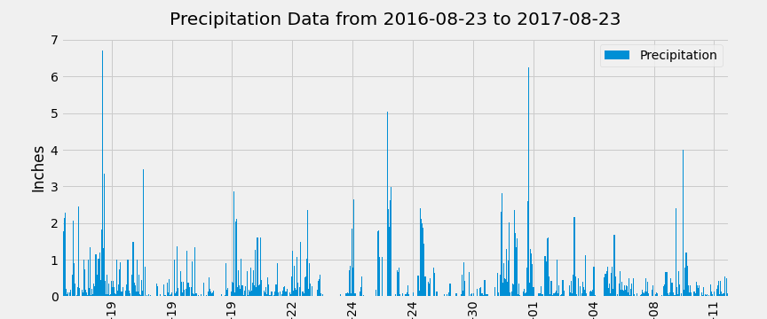
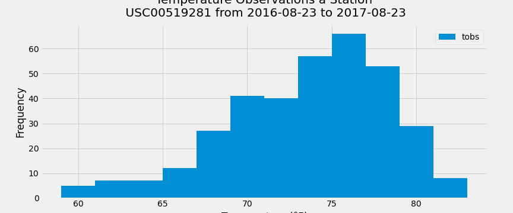
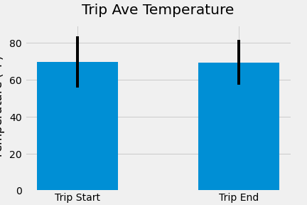
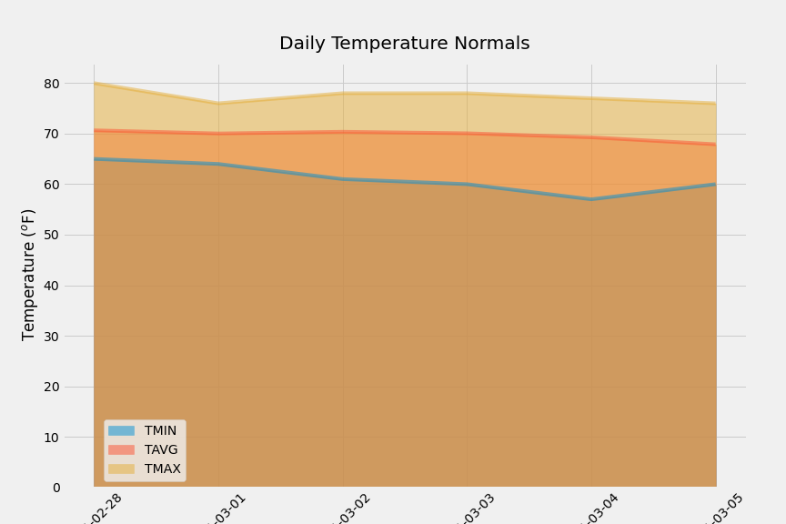
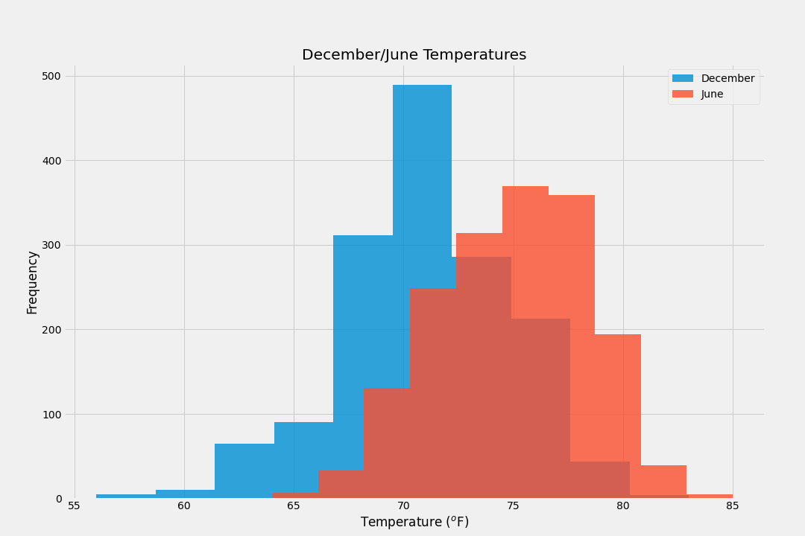

# sqlalchemy-challenge
## Introduction

This is my submission for the SQLalchemy Challenge homework.


## Structure
```
|_Resources
	|_hawaii.sqlite
	|_hawaii_measurements.csv
	|_hawaii_stations.csv
|_app.py					## python program to create rest api from hawaii sqlite queries
|_climate.ipynb					## jupyter notebook with queries and statisical analysis/visualisations
|_.gitignore
|_README.md

```

## Usage

```
python 3.8.5
pandas 1.2.4
matplotlib 3.3.4
sqlalchemy 1.4.7
scipy 1.6.2
sqlite 3.35.4
flask 1.1.2
numpy 1.20.1
datetime

```
## Summary

The Hawaii weather database contained weather observations from 9 stations between 01-01-2010 and 23-08-2017. <br>

The final 12 months of percipition data is shown below and indicates peak rainfall events in September, January and May:

<br>



<br>

The most active station was USC00519281 (WAIHEE), which also had the greatest number of temperature observations. A histogram of the last 12 months of temperature data from this station shows that the temperature is left skewed due to some lower extreme temperature recordings: 




<br>

The trip period chosen for analysis was between 2012-02-28 and 2012-03-05. There does not appear to be much variation in temperature average, maximum and minimums for that period plus the date month and day for the previous year as shown below:

<br>



<br>

The station with the greatest ammount of preciption in the same days and months of the trip the previous year, i.e., between 2011-02-28 and 2011-03-05, was USC00519281 (WAIHEE) at 11 inches total. The stations with the lowest rainfall were:
<br>
|ID|Name|Total Precipiptation (inches)|
| -|-|-|
|USC00519397|WAIKIKI|1.18|
|USC00511918|HONOLULU OBSERVATORY|0.76|
|USC00514830|KUALOA RANCH HEADQUARTERS|0.03|
|USC00517948|PEARL CITY|0.0|

<br>
The trip should plan to centre around these areas for the best weather.
<br>

The temperature daily normals for that time period indicate consistant temperature across the time period, showing that there is unlikely to be a significant change in weather to ruin the trip:

<br>




<br>

Comparision of temperatures in December compared to June show that there is a statistically significant difference in temperature between the two months. The p-value of the independant t-test is very small (4.19e-187). Therefore it does matter which dates to plan for a trip to Hawaii.


<br>




